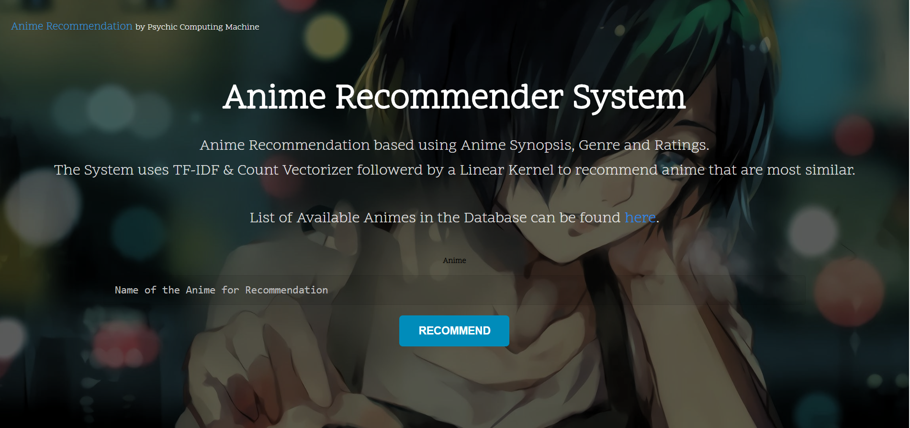
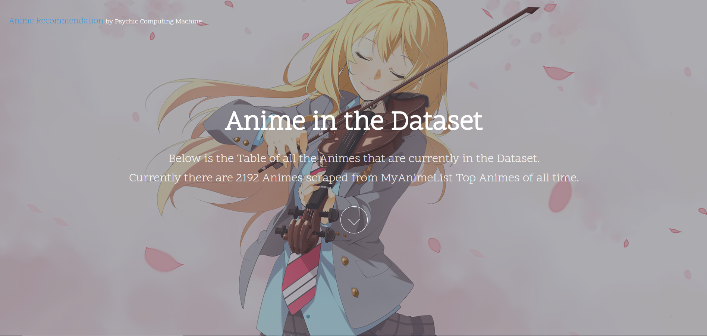
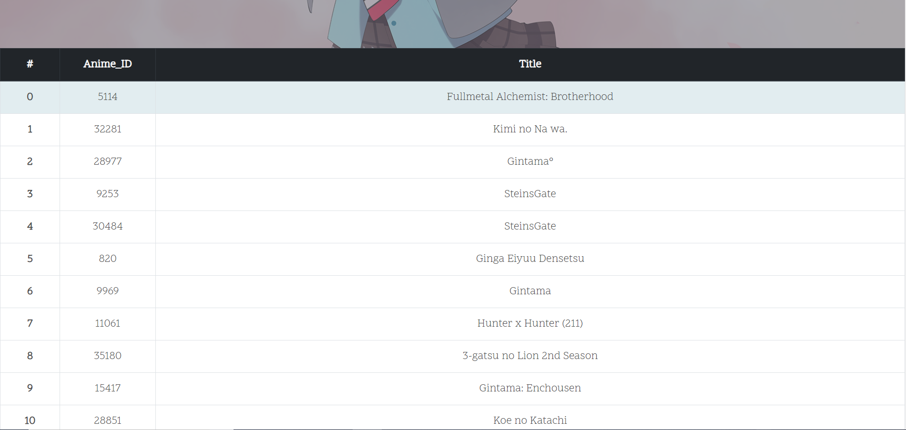

# Anime-Recommender-System
`Anime-Recommender-System` is my side project to enhance my knowledge in <i>Machine Learning, Python, Flask</i> and <i>Web Development</i>. <br>
It is a Recommender System to recommend similar animes to users using genre, synopsis, and ratings.

## Installation

```shell
 git clone https://github.com/Yashs744/Anime-Recommender-System.git
 
 cd Anime-Recommender-System
```

Inside `Anime-Recommender-System` directory.
```shell
pip3 install -r Requirements.txt

python3 server.py
```

Go to http://127.0.0.1:8000 to get a live preview of the website.

---

## Screenshots




